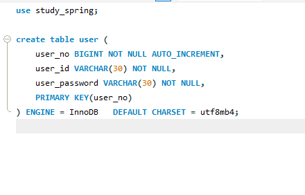
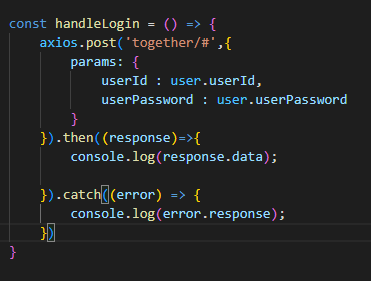
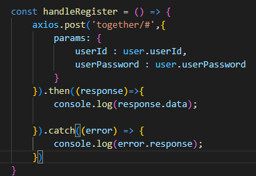

# Together_Study_Spring!

### 1주차 스터디 - 2023.01.27 ~ 2023.02.05 
DB 구조  

react 수정해야할 부분  
1. src/page/Login.js 파일의 handleLogin fnc  
  
 1.1  axios.post -> post 부분을 원하는 메소드로 변경(필수 아님)  
 1.2  together/# -> # 부분을 원하는 url 로 변경  
          
2. src/page/Register.js 파일의 handleRegister fnc  
  
  2.1 axios.post -> post 부분을 원하는 메소드로 변경(필수 아님)  
  2.2 together/# -> # 부분을 원하는 url 로 변경
